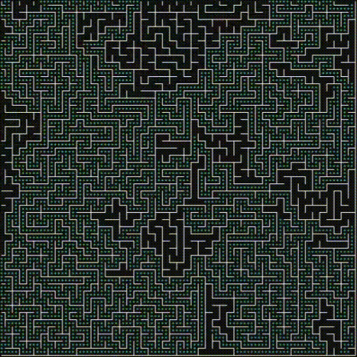

# library-brainmap

<p align="center">
    <a href="https://github.com/badcast/ronin-engine">
        
    </a>
</p>

<p align="center">
    
    <br>
    <em>Figure 1: Illustration created using <a href="https://github.com/badcast/ronin-engine">Ronin Engine</a></em>
</p>

<p align="center">
    Brain Neuron Map - for Generate Maze and Path-Finder interface.
</p>

---

## Table of Contents

- [Introduction](#introduction)
- [Features](#features)
- [Integration with Ronin Engine](#integration-with-ronin-engine)
- [Installation](#installation)
- [Usage](#usage)
- [Examples](#examples)
- [Contributing](#contributing)
- [License](#license)

---

## Introduction

**library-brainmap** is a powerful library that enables you to create captivating Brain Neuron Maps, generate intricate mazes, and seamlessly integrate a user-friendly path-finding interface into your projects. Whether you're a developer, a researcher, or simply an enthusiast, this library opens up endless possibilities for representing and navigating complex systems.

## Features

- **Brain Neuron Map Generation:** Design visually striking neuron maps that emulate the intricate connections within a brain.
- **Maze Generation:** Effortlessly generate mazes of varying complexity, perfect for games, puzzles, and simulations.
- **Path-Finding Interface:** Implement an intuitive path-finding interface to navigate through your designed maps and mazes.
- **Customization:** Fine-tune the appearance and behavior of your maps and mazes to match your project's unique requirements.

## Integration with Ronin Engine

**library-brainmap** is proudly integrated with [Ronin Engine](https://github.com/badcast/ronin-engine), enhancing the visualization capabilities of the engine with brain neuron maps and maze generation. The illustration in Figure 1 showcases the creative potential when using **library-brainmap** within the [Ronin Engine](https://github.com/badcast/ronin-engine) environment.

<p align="center">
    <a href="https://github.com/badcast/ronin-engine">
        
    </a>
</p>

## Installation

To begin using **library-brainmap**, follow these simple steps:

1. Clone the repository:
    ```bash
    git clone https://github.com/badcast/library-brainmap.git
    ```

2. Navigate to the library directory:
    ```bash
    cd library-brainmap
    ```

3. Build the library using CMake:
    ```bash
    mkdir build
    cd build
    cmake ..
    cmake --build .
    ```

## Usage

Utilizing **library-brainmap** is straightforward:

1. Include the appropriate headers in your CMake project:
    ```cmake
    include_directories(${CMAKE_SOURCE_DIR}/path/to/library-brainmap/include)
    ```

2. Link against the built library:
    ```cmake
    target_link_libraries(your_project PRIVATE brainmap)
    ```

## Examples

Explore the [examples](test/) directory for detailed usage scenarios and inspiration for your own projects.

## Contributing

We welcome contributions of all forms! Whether you're fixing a bug, enhancing documentation, or introducing a new feature, your efforts contribute to the enrichment of this library. Refer to our [Contribution Guidelines](CONTRIBUTING.md) to get started.

## License

This project operates under the [GPL3 License](LICENSE).

---

For any inquiries or support, feel free to contact us at `badcast`. We're excited to see the innovative ways you'll utilize **library-brainmap** for visualization and exploration!
